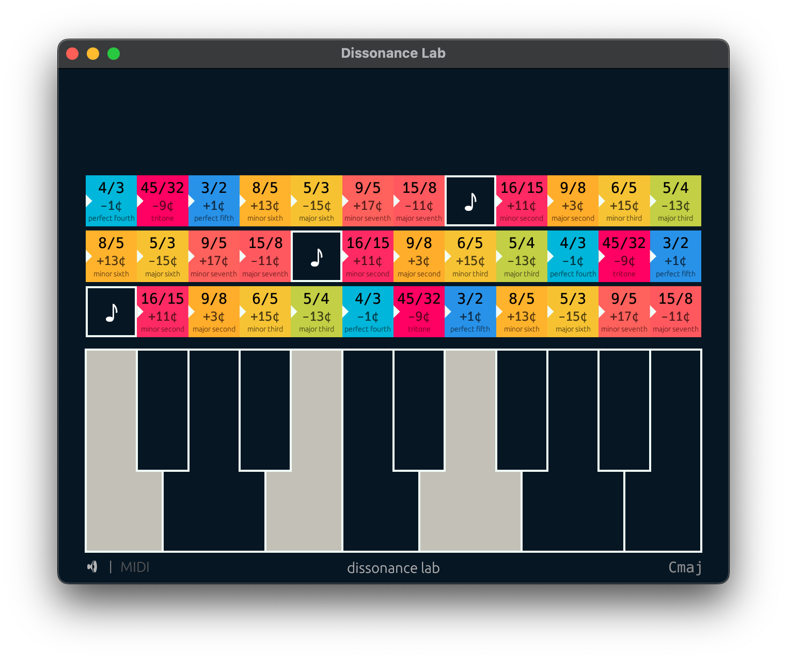

# Dissonance Lab



Test at https://jnises.github.io/dissonance-lab/

Small gui to explore the dissonance of different intervals and chords on a piano.
Includes midi input and a simple piano synth implemented as a webaudio worklet.

The colorful rows above the piano show the interval for each other key when one or more is pressed.
The pressed keys are considered the root of each interval even when it isn't the lower note.


## Requirements
* Rust toolchain ([rustup.rs](https://rustup.rs/))
* Trunk `cargo install trunk`
* wasm-pack `cargo install wasm-pack`

## Running

### Development Environment
For the best development experience, use the included development tools that start both the frontend and log server:

```bash
cargo xtask dev
```

This will:
- Start the development log server on port 3001
- Start the Trunk development server on port 8080
- Automatically generate index.html with debug utilities
- Forward frontend console logs to your terminal

Navigate to http://127.0.0.1:8080/

Note that you need to manually unmute by clicking the 🔇 button. This is due to the browser autoplay blocking feature.

### Manual Development
If you prefer to run components separately:

```bash
trunk serve
```
Navigate to http://127.0.0.1:8080/#dev
The #dev disables the pwa cache so that we get the latest version of the page.

### Production Build
```bash
cargo xtask build
```

Or manually:
```bash
trunk serve --release
```

## Testing
```
cargo test
```

Tests run as native binaries by default.

## Development Notes
The project includes:
- **Frontend log forwarding**: Console logs from the browser are forwarded to the terminal during development
- **Audio worklet processing**: Real-time audio synthesis using WebAssembly
- **Cross-platform build support**: Automatic target detection for different platforms

When you want to deploy to production you should make sure to update `cacheName` in `sw.js` to invalidate the cache.
